# ACLLib

> ACLLib 是一个纯教学用途的纯 C 语言图形库，它并非任何产业界在使用的图形库，也不会有机会发展成为流行的图形库。它只是我们为了 C 语言学习的目的自己开发的非常简单的图形库。它基于 MS Windows 的 Win32API，所以在所有的  Windows 版本上都能使用。但是也因此它无法做成跨平台的库在其他操作系统上使用。

- 是一个基于  Win32API 的函数库，提供了相对较为简单的方式来做 Windows 程序
- 实际提供了一个 `.c` 和两个 `.h` ，可以在 MSVC 和 Dev C++ （MinGW）中使用
- 以 GPL 方式开源放在 Github 上
- 纯教学用途，但是编程模型和思想可以借鉴

### Windows API

- 从第一个 32 位的 Windows 开始就出现了，就叫做 Win32API
- 是一个纯 C 的函数库，就和 C 标准库一样，使你可以写 Windows 应用程序
- 过去很多 Windows 程序是⽤用这个方式做出来的

#### `main()`

- `main()` 成为 C 语言的的入口函数其实和 C 语言本身无关，你的代码是被一小段叫做启动代码的程序所调用的，它需要一个叫 `main` 的地方
- 操作系统把你的可执行程序装载到内存里，运行启动，然后调用你的 `mian` 函数

#### `WinMain()`

- As `mian()` is the entry function of  an ordinary C program, `WinMain()` is the one in Win32API program.
- Windows applications have a different "startup" code that needs a function `WinMain()`

```c++
#include <windows.h>
int WINAPI WinMain(
    HINSTANCE hInstance,
    HINSTANCE hPrevInstance,
    LPSTR lpCmdLine,
    int nCmdShow 
) {
    MessageBox(NULL, "Goodbye, cruel world!", "Note", MB_OK);
    return 0;
}
```

- `WinMain()`
  - 初始化一个窗口结果然后注册给 Windows OS
  - 运行一个无限循环来读入和处理
- 不同的函数来处理不同的消息

:exclamation: TOO HARD

## ACLLib 结构

- `WinMain()`
  - 初始化窗口结构并注册给 Windows OS
  - ==调用你的 `Setup()`==
  - 跑一个无限循环来读入并处理 Windows 消息
- 当有用户动作发生的时候，==调用你的回调函数来处理==
- 基本流程​ ⬇

  

  - `Setup()`
    - 是用来初始化窗口，注册接收消息的回调函数的

## ACLLib 的基本绘图

### 创建图形窗口

- `void initWindow(const char *name, int left, int top, int width, int height);`

- ```c
  #include "acllib.h"
  
  int Setup() {
  	initWindow("Hello world!", DEFAULT, 100, 200, 200);
  	return 0;
  }
  ```

### 坐标系

- 在 Windows 中，坐标是以像素点的数字来定义的。对于你创建出来的窗口，左上角是 `(0, 0)` ，x 轴自左向右增长，而 y 轴自上而下增长

  

### 终端窗口

- 如果需要用到 `scanf` 和 `printf` ，则首先需要 `initConsole();`

### 启动结束绘画

- `void beginPaint();`
- `void endPaint();`
- 任何绘图函数的调用都必须在这对函数调用之间

### 点

- `void putPixel(int x, int y, ACL_Color color);`
- `ACL_Color getPixel(int x, int y);`

### 颜色

- `RGB(r, g, b)`
- `BLACK` `RED` `GREEN` `BLUE` `CYAN` `MAGENTA` `YELLOW` `WHITE`

### 线

- `void moveTo(int x, int y);`
- `void moveRel(int dx, int dy);`
- `void line(int x0, int y0, int x1, int y1);`
- `void lineTo(int x, int y);`
- `void lineRel(int dx, int dy);`
- `void arc(int nLeftRext, int nTopRect, int nRightRect, int nBootomRect, int nXStartArc, int nYStartArc, int nXEndArc, int nYEndArc);`

### 画笔

- `void setPenColor(ACL_Color color);`

- `void setPenWidth(int width);`

- `void setPenStyle(ACL_Pen_Style style);`

  - ```c
    PEN_STYLE_SOLID,
    PEN_STYLE_DASH,			/* -------  */
    PEN_STYLE_DOT,			/* .......  */
    PEN_STYLE_DASHDOT,		/* _._._._  */
    PEN_STYLE_DASHDOTDOT,	/* _.._.._  */
    PEN_STYLE_NULL
    ```

### 面

- `void chrod(int nLeftRect, int nTopRect, int nRightRect, int nBottomRect, int nXRadial1, int nYRadial1, int nXRadial2, int nYRadial2);`
- `void ellipse(int nLeftRect, int nTopRect, int nRightRect, int nBottomRect);`
- `void pie(int nLeftRect, int nTopRect, int nRightRect, int nBottomRect, int nXRadial1, int nYRadial1, int nXRadial2, int nYRadial2);`
- `void polygon(const POINT *lpPoints, int nCount);`
- `void rectangle(int nLeftRect, int nTopRect, int nRightRect, int nBottomRect);`
- `void roundrect(int nLeftRect, int nTopRect, int nRightRect, int nBottomRect, int nWidth, int nHeight);`

### 刷子

- 画笔负责线面及面的边缘，刷子负责面的内部

- `void setBrushColor(ACL_Color color);`

- `void setBrushStyle(ACL_Brush_Style style);`

  - ```c
    BRUSH_STYLE_SOLID = -1,
    BRUSH_STYLE_HORIZONTAL,		/* ----- */
    BRUSH_STYLE_VERTICAL,		/* ||||| */
    BRUSH_STYLE_FDIAGONAL,		/* \\\\\ */
    BRUSH_STYLE_BDIAGONAL,		/* ///// */
    BRUSH_STYLE_CROSS,			/* +++++ */
    BRUSH_STYLE_DIAGCROSS,		/* xxxxx */
    BRUSH_STYLE_NULL
    ```

### 文字

- `void setTextColor(ACL_Color color);`
- `void setTextBkColor(ACL_Color color);`
- `void setTextSize(int size);`
- `void setTextFont(const char *pFontName);`
- `void paintText(int x, int y, const char *pStr);`