# LinkedList

> Basic idea: 
>
> 

data structure

```c
// node.h
typedef struct _node {
  int value;
  struct _node *next;// next, 
} Node;
```

basic operation

- [insert head](#insert head)
- [function](#function)
- [traversal](#traversal)/[search](#search)
- [remove](#remove)
- [clear all](#clear all)

- [append tail](#append tail)

## Construct

```c
#include <stdio.h>
#include "node.h"

int main(int argc, char const *argv[]) {
    int number;
    do {
        scanf("%d", &number);
        if (number != -1)
    }while (number != -1);
    return 0;
}
```


### insert head

1. Create a new node

   ```c
   Node * head = NULL;
   //int number;
   //...
   ```

   

2. Make the new next point to the head

   ```c
   //...
   #include <stdlib.h>
   
   //scanf("%d", number);
   if (number != -1) {
       // add to linked-list
       Node *p = (Node*)malloc(sizeof(Node));
   }
   ```

   

3. Point the head to the new node

   ```c
   //Node *p = (Node*)malloc(sizeof(Node));
   p->value = number;
   p->next = NULL;
   
   // find the `last`
   Node *last = head;
   if (last) {// if `last` isn't `NULL`
       while (last->next) {// if the `last` has a `next`
           last = last->next;
       }// the `last` is last
   
       // attach
       last->next = p;
   }else {// `last` is `NULL`
       head = p;
   }
   ```


general

```c
#include <stdio.h>
#include "node.h"

int main(int argc, char const *argv[]) {
    Node * head = NULL;
    int number;
    do {
        scanf("%d", &number);
        if (number != -1){
            // add to linked-list
            Node *p = (Node*)malloc(sizeof(Node));
            p->value = number;
            p->next = NULL;
            // find the last
            Node *last = head;
            if (last) {
                while (last->next) {
                    last = last->next;
                }
                // attach
                last->next = p;
            }else {
                head = p;
            }
        }
    }while (number != -1);
    return 0;
}
```


### function

```c
#include <stdio.h>
#include "node.h"

int main(int argc, char const *argv[]) {
    int number;
    do {
        scanf("%d", &number);
        if (number != -1) {
            // there are the function
        }
    }while (number != -1);
    return 0;
}
```


1. `void add(Node* head, int number);`

    ```c
    			//there are the function
    			add(head, number);
    //...
    void add(Node* head, int number) {
        // add to linked-list
        Node *p = (Node*)malloc(sizeof(Node));
        p->value = number;
        p->next = NULL;
        // find the last
        Node *last = head;
        if (last) {
            while (last->next) {
            last = last->next;
            }
            // attach
            last->next = p;
        }else {
            head = p;// ERROR! Cannot change the `head` variables outside the function. Maybe we could set a global variable, but that's dangerous.
        }
    }
    ```

    

2. `Node *add(Node* head, int number);`

    ```c
    			//there are the function
    			head = add(head, number);// This function requires us to be very careful to remember this thing.
    //...
    Node* add(Node* head, int number) {
        // add to linked-list
        Node *p = (Node*)malloc(sizeof(Node));
        p->value = number;
        p->next = NULL;
        // find the last
        Node *last = head;
        if (last) {
            while (last->next) {
            last = last->next;
            }
            // attach
            last->next = p;
        }else {
            head = p;
        }
        return head;
    }
    ```


3. `Node* add(Node** pHead, int number)`

    ```c
    			//there are the function
    			head = add(&head, number);// A pointer is passed in 
    //...
    Node* add(Node** pHead, int number) {
        // add to linked-list
        Node *p = (Node*)malloc(sizeof(Node));
        p->value = number;
        p->next = NULL;
        // find the last
        Node *last = *pHead;
        if (last) {
            while (last->next) {
            last = last->next;
            }
            // attach
            last->next = p;
        }else {
            head = p;
        }
        //return head;
    }
    ```

    

4. `void add(List* pList, int number)`

    ```c
    // struct List
    typedef struct _list {// The advantage is that we use a self-defined data structure, list, to represent the entire chain table.
        Node* head;
        //It will become more efficient
        //Node* tail;
    } List;
    
    int main() {
        // Node * head = NULL;
        List list;
        int number;
        list.head = NULL;
        do {
            scanf("%d", &number);
            if (number != -1) {
                head = add(&list, number);// At this point, you are allowed to forget to assign the value
            }
        }while (number != -1);
        return 0;
    }
    
    void add(List* pList, int number) {
        // add to linked-list
        Node *p = (Node*)malloc(sizeof(Node));
        p->value = number;
        p->next = NULL;
        // find the last
        Node *last = pList->head;
        if (last) {
            while (last->next) {// It's troublesome
                last = last->next;
            }
            // attach
            last->next = p;
        }else {
            pList->head = p;
        }
    }
    ```

    

### traversal

遍历

```c
// a classic traversal model
Node *p;
for (p=list.head; p; p=->next) {
    printf("%d\r", p->value);
}
printf("\n");
```

↑ make it as a function

```c
void print(List *pList);

//  print(&list);

void print(List *pList) {
    Node *p;
    for (p=pList->head; p; p=->next) {
        printf("d\r", p->value);
    }
    printf("\n");
}
```

### search

Find the value and return the pointer

```c
// search
scanf("%d", &number);
Node *p;
int isFound = 0;
for (p=list.head; p; p=p->next) {
    if (p->value == number) {
        printf("Found it\n");
        isFound = 1;
        break;
    }
}
if (!isFound) {
    printf("Not found it\n");
}
```

### remove

```c
//Node *p;
Node *q;
for (q=NULL, p=list.head; p; q=p, p=p->next) {
   if (p->value == number) {
       q->next = p->next;
       free(p);
       break;
   }
}
```

How do we find the boundary?

- Any pointer at the left of `->` must be checked.
- In the code above, `q` didn't be checked.
- What if `q` is the head?

```c
//Node *p;
Node *q;
for (q=NULL, p=list.head; p; q=p, p=p->next) {
   if (p->value == number) {
       if (q) {
           q->next = p->next;
       }else {
           list.head = p->next;
       }
     //q->next = p->next;
       free(p);
       break;
   }
}
```

### clear all

There comes a time when clear the whole linked-list

```c
for (p=head; p; p=q) {
    q = p->next;
    free(p);
}
```

```c
void clear(Node *head) {
    if (head->next) {
        clear(head->next);
    }
    free(head);
}
```

## Expansion

I don't fucking get it.

### append tail

- find the tail
- `tail->next = n;`
- `n->next = 0;`


What if empty list?
