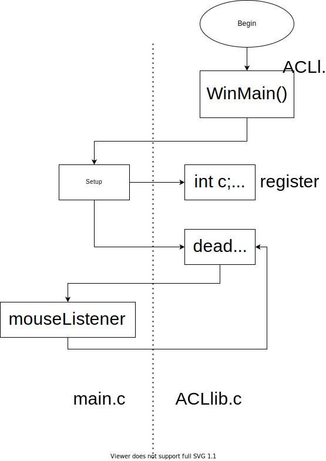

# 交互图形设计

> 用C语言编写图形程序不是C语言所擅长的。本周我们安排的这些内容的最终目的也不是在于图形界面程序设计。
>
> 我们所希望你学会的，是函数指针和交互图形界面程序中所体现出来的设计模式。
>
> 所以，无论你是否有Windows来实验这里的交互图形程序，函数指针和MVC设计模式都是值得你深入理解的。

## 图形程序的终端输入输出

```c
#include "acllib.h"
#include <stdio.h>

int Setup() {
    initWindow("Test", DEFAULT, DEFAULT, 800, 600);
    initConsole();// terminal
    printf("Hello\n");
    
    return 0;
}
```

## 函数指针及其应用

### 函数指针

```c
#include <stdio.h>

int main(void) {
    int i = 0;
    printf("%p\n", &i);
    
    return 0;
}

// 0x7fff5212cc0
```

```c
#include <stdio.h>

int main(void) {
    int i = 0;
    int a[] = {1, 2};
    printf("%p\n", main);
    
    return 0;
}

// 0x1099e7ef0
```

```c
#include <stdio.h>

void f() {
    
}

int main(void) {
    int i = 0;
    int a[] = {1, 2};
    printf("%p\n", main);
    printf("%p\n", f);// `f` is the address of the function
    printf("%p\n", a);
    
    return 0;
}

// 0x10393dec0
// 0x10393deb0
// 0x7fff5c2c2ce0
```

```c
#include <stdio.h>

void f() {
    
}

int main(void) {
    int i = 0;
    int *p = &i;
    * p = 20;
    f;
    int a[] = {1, 2};
    printf("%p\n", main);
    printf("%p\n", f);// `f` is the address of the function
    printf("%p\n", a);
    
    return 0;
}

// warning
```

```c
#include <stdio.h>

void f() {
    
}

int main(void) {
    int i = 0;
    int *p = &i;
    * p = 20;
    int a[] = {1, 2};
    p = f;// An attempt to assign a value
    printf("%p\n", main);
    printf("%p\n", f);
    printf("%p\n", a);
    
    return 0;
}

// warning: incompatible pointer types assigning to 'int *' from 'void ()'
//       [-Wincompatible-pointer-types]
//     p = f;
//       ^ ~
// 1 warning generated.
```

```c
#include <stdio.h>

void f(void) {// Good habit
    
}

int main(void) {
    int i = 0;
    int *p = &i;
    * p = 20;
    int a[] = {1, 2};
    void(*pf)(void)= f;// A normal style
    printf("%p\n", main);
    printf("%p\n", f);
    printf("%p\n", a);
    
    return 0;
}
```

```c
#include <stdio.h>

void f(void) {
    printf("Calling a function\n");
}

int main(void) {
    int i = 0;
    int *p = &i;
    * p = 20;
    int a[] = {1, 2};
    void(*pf)(void)= f;
    f();
    (*pf)();
    printf("%p\n", main);
    printf("%p\n", f);
    printf("%p\n", a);
    
    return 0;
}

// Calling a function
// Calling a function
// 0x10393dec0
// 0x10393deb0
// 0x7fff5c2c2ce0
```

### 函数指针的使用

```c
#include <stdio.h>

void f(int i) {
    printf("Calling a function, %d\n", &i);
}

int main(void) {
    int i = 0;
    int *p = &i;
    * p = 20;
    int a[] = {1, 2};
    void(*pf)(int)= f;
    f(20);
    (*pf)(10);
    printf("%p\n", main);
    printf("%p\n", f);
    printf("%p\n", a);
    
    return 0;
}

// Calling a function, 20
// Calling a function, 10
// 0x10393dec0
// 0x10393deb0
// 0x7fff5c2c2ce0
```

```c
#include <stdio.h>

void f(int i) {
    printf("f(), %d\n", &i);
}
void g(int i) {
    printf("g(), %d\n", &i);
}
void h(int i) {
    printf("h(), %d\n", &i);
}

int main() {
    int i = 0;
    scanf("%d", &i);
    
    switch(i) {
        case 0:f(0);break;
        case 1:g(0);break;
        case 2:h(0);break;
    }
}

// TROUBLESOME
```

```c
#include <stdio.h>

void f(int i) {
    printf("f(), %d\n", &i);
}
void g(int i) {
    printf("g(), %d\n", &i);
}
void h(int i) {
    printf("h(), %d\n", &i);
}

int main() {
    int i = 0;
    void(*fa[])(int) = {f, g, h};
    scanf("%d", &i);
    
    if (i>=0 && i<sizeof(fa)/sizeof(fa[0])) {
        (*fa[i])(0);
    }
    // switch(i) {
    //     case 0:f(0);break;
    //     case 1:g(0);break;
    //     case 2:h(0);break;
    // }
}
```

```c
#include <stdio.h>

int plus(int a, int b) {
    return a+b;
}

int ninus(int a, int b) {
    return a-b;
}

void cal(int (*f)(int, int)) {
    printf("%d", (*f)(2,3));
}

int main() {
    cal(plus);
    cal(ninus);// `cal()` 不需要作改变，传入函数有变即随之变化
    
    return 0;
}
```

## 交互图形程序设计

### 回调函数

> 程序运行在某个地方，会有一个 register 类的函数，可以把一个函数指针交给某个地方去保存下来，指向一个自运行的函数。到某个必要时刻，如点击鼠标，假如已经注册了一个如果鼠标点击就作 m 的事件，一旦发现点击事件后就会回来调用该注册事件

> 回调函数就是一个通过函数指针调用的函数。如果你把函数的指针（地址）作为参数传递给另一个函数，当这个指针被用来调用其所指向的函数时，我们就说这是回调函数。

> A "callback" is any function that is called by another function which takes the first function as a parameter

ACLlib 中的实现

```c
#include "acllib.h"
#include <stdio.h>

void mouseListener(int x, int y, int button, int event) {
    printf("x=%d, y=%d, button=%d, event=%d\n", x, y, button, event);// Debugging informations
}

int Setup() {
    initWindow("Test", DEFAULT, DEFAULT, 800, 600);
    initConsole();
    printf("Hello\n");
    int x;
    
    registerMouseEvent(mouseListener);// a callback function, need a pointer parameter
    beginPaint();
    
    line(10, 10, 100, 100);
    
    endPaint();
    
    return 0;
}
```



### 图形交互消息

#### The Call

There are four messages we can handle

- `typedef void(*KeyboardEventCallback)(const char key);`
- `typedef void(*CharEventCallback)(int key);`
- `typedef void(*MouseEventCallback)(int x, int y, int button, int status);`
- `typedef void(*TimerEventCallback)(int timerID);`

```c
#include "acllib.h"
#include <stdio.h>

void mouseListener(int x, int y, int button, int event) {
    static int ox = 0;
    static int oy = 0;
    printf("x=%d, y=%d, button=%d, event=%d\n", x, y, button, event);
    beginPaint();
    lineTo(ox,oy, x, y);
    endPaint();
    ox = x; oy = y;
}

void keyListener(int key, int event) {
    printf("key=%d, event=%d", key, event);
}

void timerListener(int id) {
    static int cnt=0;
    printf("id=%d\n", id);
    if (id==0) {
        cnt++;
        if (cnt==5) {
            cancelTime();
        }
    }
}

int Setup() {
    initWindow("Test", DEFAULT, DEFAULT, 800, 600);
    initConsole();
    printf("Hello\n");
    int x;
    
    registerMouseEvent(mouseListener);
    registerKeyboardEvent(keyListener);
    registerTimerEvent(timerListener);
    startTimer(0, 500);// void startTimer (int id, int timeinterval)
    
    beginPaint();
    
    line(10, 10, 100, 100);
    
    endPaint();
    
    return 0;
}
```

