# 判断

> 根据比较的结果，决定做、还是不做某些动作，就要用到 if 语句。
>
> 一个基本的 if 语句由一个关键字 if 开头，跟上在括号里的一个表示条件的逻辑表达式，然后是一对大括号 `{}` 之间的若干条语句。如果表示条件的逻辑表达式的结果为 true ，那么就执行后面跟着的这对大括号中的语句，否则就跳过这些语句不执行，而继续下面的其他语句。

be like:

```c++
#include <stdio.h>

int main() {

    int hour1, minute1;
    int hour2, minute2;
    
    scanf("%d %d", &hour1, &minute1);
    scanf("%d %d", &hour2, &minute2);
    
    int ih = hour2 -hour1;
    int im = minute2 - minute1;
    if (im < 0){
        im = 60 + im;
        ih --;
    }
    
    printf("时间差是%d小时%d分。\n", ih, im);
    return 0;
}
```

- 没有`{}`

  ```c++
  if (1)
      printf("hello");
  if (0)
      printf("world");
  else
      printf("!");
  //hello!
  ```

  > if 语句这一行结束时没有表示语句结束的`;`，而后面的赋值语句写在 if 的下一行，并该行结束时有表语句结束的`;`。
  >
  > 这表明这条赋值语句是 if 语句的一部分，if 语句拥有和控制这条赋值语句，决定它要不要被执行。


### 布尔类型(bool)

须先导入库`#include<stdbool.h>`，后即可使用`bool`、`true`、`false`

```c++
#include <stdio.h>
#include <stdbool.h>

int main() {
    bool b = 5>6;
    bool t = true;
    t = 3;// bool 类型实质上是整数
    printf("b=%d\n", b);//b=0
    return 0;
}
```

### 关系运算

计算两个值之间的关系，叫关系运算

| 运算符 | 意义     |
| ------ | -------- |
| `==`   | 相等     |
| `!=`   | 不等     |
| `>`    | 大于     |
| `>=`   | 大于等于 |
| `<`    | 小于     |
| `<=`   | 小于等于 |

- 关系运算的结果

  当两个值的关系符合关系运算符的预期时，关系运算的结果为1，否则为0。

  ```c++
  printf("%d\n", 5==3);//0
  printf("%d\n", 5>3);//1
  printf("%d\n", 5<=3);//0
  ```

- 优先级
  - 所有的关系运算符的优先级比算数运算的低，比赋值运算的高。
  - 判断是否相等的 `==` 和 `!=` 的优先级被其它的低，连续的关系运算是从左到右的。

### 逻辑运算

- 逻辑运算是对逻辑量进行的运算，结果只有0或1
- 逻辑量是关系运算或逻辑运算的结果

| 运算符 | 描述 | 示例     |
| ------ | ---- | -------- |
| `!`    | 非   | `!a`     |
| `&&`   | 与   | `a && b` |
| `||`   | 或   | `a || b` |

#### 短路

逻辑运算是自左向右进行的，如果左边的结果已经能够决定结果了，就不会做右边的计算。

- 对于 `&&`，左边的是 false 时就不做右边了
- 对于 `||`，左边的是 true 时就不做右边了
- 不要把赋值（包括复合赋值）组合进表达式

### 条件运算

- `count = (count>20) ? count - 10 : count + 10;`

  - 条件：`(count>20)`

  - 条件满足时的值：`count - 10`

  - 条件不满足时的值：`count + 10`

- 即：

  ```c++
  if (count > 20)
      count = count - 10;
  else
      count = count + 10;
  ```

  

- 条件运算符

  - `?`、`:`

  - 条件运算符的优先级高于赋值运算符，但是低于其他运算符

  - 自右向左结合

  - 尽量不使用嵌套的条件表达式，如

    ```c++
    count = (count>20)?(cout<50)?count-10:count-5:(count<10)?count+10:count+5;
    ```

### 逗号运算符

- 逗号用来连接两个表达式，并以其右边的表达式的值作为它的结果
- 优先级：最低
- 结合关系：自左向右；左边的表达式会先计算，而右边的表达式的值就留下了作为逗号运算的结果
- 可用于`for`循环：`for(i=0,j=10;i<j;i++,j--)`

## if-else

```c++
int a, b, c;
scanf("%d %d %d", &a, &b, &c);

int max = 0;

if (a>b) {
    if (a>c) {
        max = a;
    }else {
        max = c;
    }
}else {
    if (b>c) {
        max = b;
    }else {
        max = c;
    }
}
```



```c++
/*math
f(x)=-1;x<0
	  0;x=0
	 2x;x>0
*/
int f;
if (x<0) {
    f = -1;
}else if (x==0) {
    f = 0;
}else {
    f = 2*x;
}
```


## switch-case

```c++
switch (控制表达式) {
    case 常量:
        语句
        ……
    case 常量:
        语句
        ……
    default:
        语句
        ……
}
```

- 控制表达式必须是整数型的结果
- 常量可以是常数，也可以是常数计算的表达式

### break

```c++
switch (type) {
    case 1:
    case 2:
        printf("你好\n");
        break;
    case 3:
        printf("晚上好\n");
    case 4:
        printf("再见\n");
        break;
    default:
        printf("啊，什么啊？\n");
        break;
}
```

- switch 语句可以看作是一种基于计算的跳转，计算控制表达式的值后，程序会跳转到相匹配的 case 处
- case（分支标号）：说明 switch 内部位置的路标
- 在执行完分支中的最后一条语句后，如果后面没有 break，就会顺序执行到下一个 case 中去，直到遇到 break，或 switch 结束