# 联合

## 类型定义

- C 语言提供了一个叫做 `typedef` 的功能来声明一个已有的数据类型的新名字，如：

  `typedef int Length;`

  使得 `Length` 成为 `int` 类型的别名

- 这样，`Length` 这个名字就可以代替 `int` 出现在变量定义和参数声明的地方了

  ```c
  Length a,b,len;
  Length numbers[10];
  ```

### 声明新的类型的名字

- 新的名字是某种类型的别名
- 改善了程序的可读性

```c
typedef long int64_t;// 重载已有的类型名字，新名字的含义更清晰，具有可移植性
typedef struct ADate{
    int month;
    int day;
    int year;
} Date;// 简化了复杂的名字

int64_t i = 100000000000000;
Date d = {9,1,2005};
```

## 联合

```c
union AnElt {
    int i;
    char c;
} elt1, elt2;

elt1.i = 4;
elt2.c = 'a';
elt2.i = 0xDEADBEEF;
```



- 储存
  - 所有的成员共享一个空间，占据了相同的内存空间
  - 同一时间只有一个成员是有效的
  - `union` 的大小是其最大的成员
- 初始化
  - 对第一个成员做初始化

### `union` 的用处

```c
#include <stdio.h>
typedef union {
    int i;
    char ch[sizeof(int)];
} CHI;

int main(int argc, char const *argv[]) {
    CHI chi;
    int i;
    chi.i = 1234;
    for (i=0; i<sizeof(int); i++) {
        printf("%02hhX", chi.ch[i]);
    }
    printf("\n");
    
    return 0;
}
```

> 这个结果表明我们所用的 CPU 是小端（还是大端）的

### 有效成员

> `union` 自己并不知道当时哪个成员是有效的
>
> 最好用另一个变量来表达这个事情

```c
union AnElt {
    int i;
    char c;
} elt1, elt2;

elt1.i = 4;
elt2.c = 'a';
elt2.i = 0xDEADBEEF;

// 如果 (elt1 当前是char) ...
```

