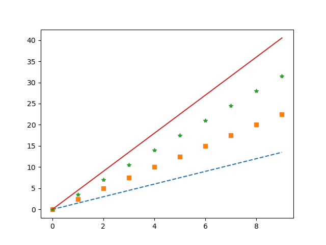
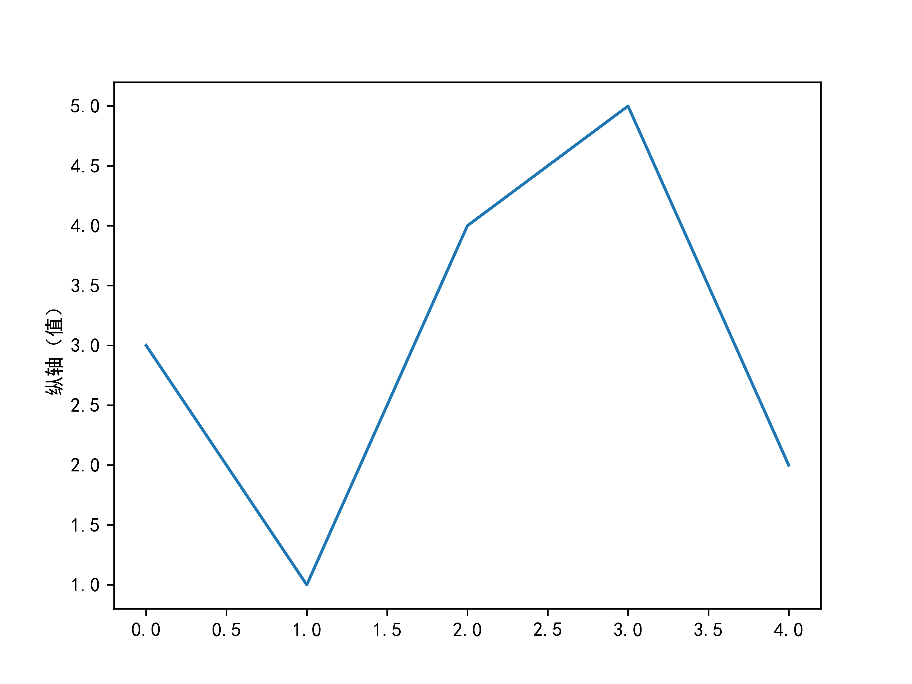
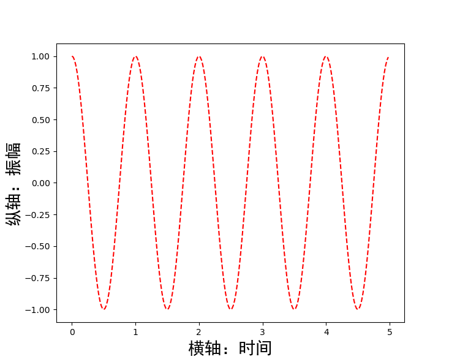
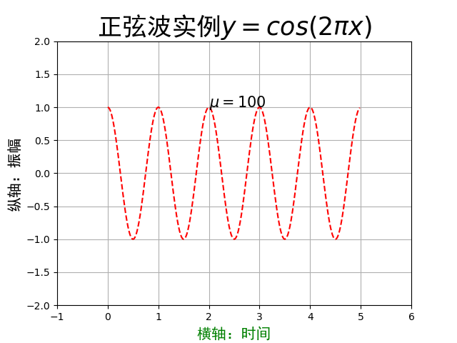
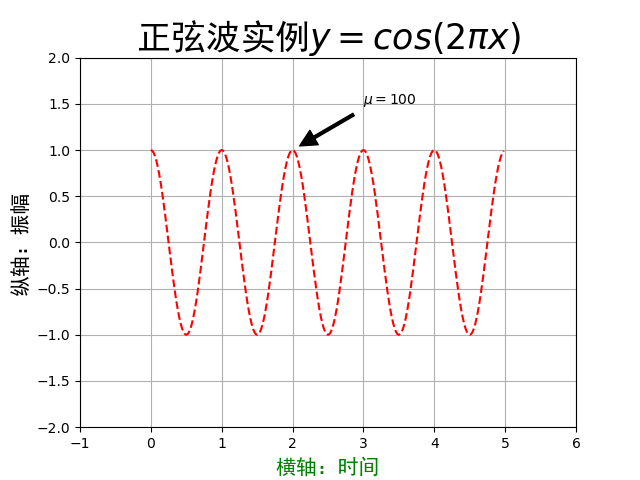
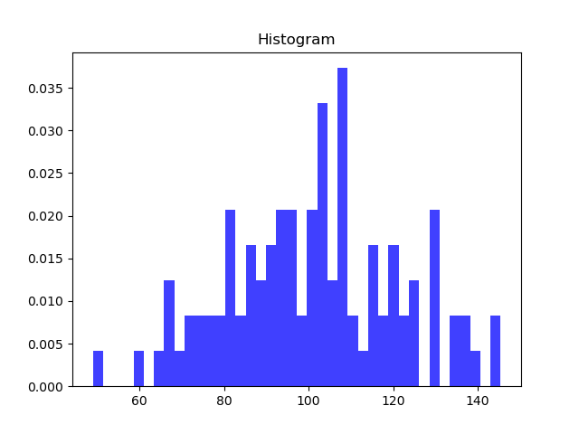
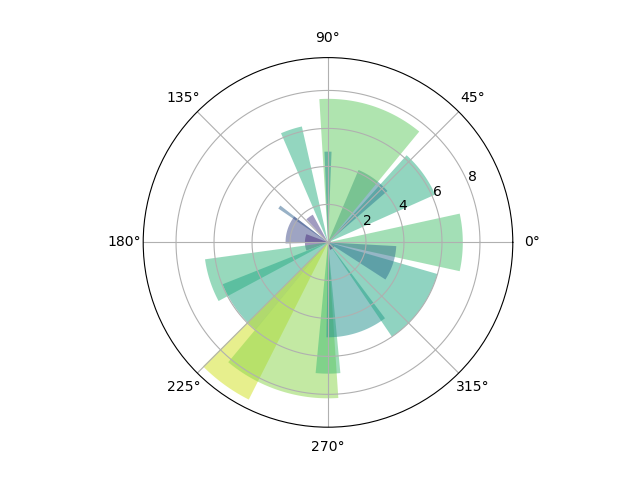
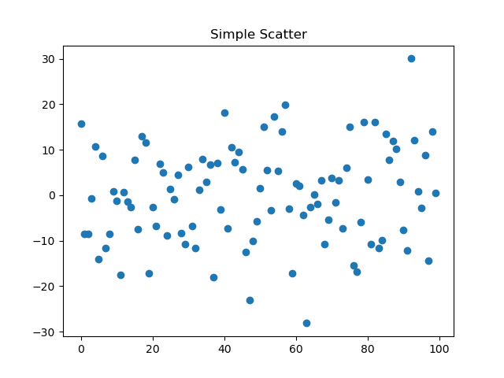

# Python-Matplotlib库入门：pyplot库

Matplotlib库由各种可视化类构成，内部结构复杂，受Matlab启发
matplotlib.pyplot是绘制各类可视化图形的命令子库，相当于快捷方式

---

`import matplotlib.pyplot as plt`

```python
In [2]: plt.plot([3, 1, 4, 5, 2])# plt.plot()只有一个输入列表或数组时，参数被当作Y轴，X轴以索引自动生成
# plt.plot(x,y)当有两个以上参数时，按照X轴和Y轴顺序绘制数据点
Out[2]: [<matplotlib.lines.Line2D at 0x11928970>]

In [3]: plt.ylabel('Grade')# plt.savefig('test', dpi=600) => PNG文件
Out[3]: Text(0, 0.5, 'Grade')

In [4]: plt.show()
```


## plot()函数

`plt.plot(x, y, format_string, **kwargs)`

- `x`：X轴数据，列表或数组，可选

- `y`：Y轴数据，列表或数组

- `format_string`：控制曲线的格式字符串，可选

  - 颜色字符

    | 颜色字符    | 说明        | 颜色字符 | 说明           |
    | ----------- | ----------- | -------- | -------------- |
    | `'b'`       | 蓝色        | `'m'`    | 洋红色 magenta |
    | `'g'`       | 绿色        | `'y'`    | 黄色           |
    | `'r'`       | 红色        | `'k'`    | 黑色           |
    | `'c'`       | 青绿色 cyan | `'w'`    | 白色           |
    | `'#000000'` | 十六进制    | `'0.8'`  | 灰度值字符串   |

  - 风格字符

    | 风格字符   | 说明   |
    | ---------- | ------ |
    | `'-'`      | 实线   |
    | `'--'`     | 破折线 |
    | `'-.'`     | 点划线 |
    | `':'`      | 虚线   |
    | `''` `' '` | 无线条 |

  - 标记字符

    | 标记字符 | 说明             | 标记字符 | 说明         | 标记字符 | 说明         |
    | -------- | ---------------- | -------- | ------------ | -------- | ------------ |
    | `'.'`    | 点标记           | `'1'`    | 下花三角标记 | `'h'`    | 竖六边形标记 |
    | `','`    | 像素标记(极小点) | `'2'`    | 上花三角标记 | `'H'`    | 横六边形标记 |
    | `'o'`    | 实心圈标记       | `'3'`    | 左花三角标记 | `'+'`    | 十字标记     |
    | `'v'`    | 倒三角标记       | `'4'`    | 右花三角标记 | `'x'`    | x标记        |
    | `'^'`    | 上三角标记       | `'s'`    | 实心方形标记 | `'D'`    | 菱形标记     |
    | `'>'`    | 右三角标记       | `'p'`    | 实心五角标记 | `'d'`    | 瘦菱形标记   |
    | `'<'`    | 左三角           | `'*'`    | 星形标记     | `'|'`    | 垂直线标记   |

- `**kwargs`第二组或更多`(x, y, format_string)`

  *当绘制多条曲线时，各条曲线的x不能忽略*

  - `color`：控制颜色，`color='green'`
  - `linestyle`：线条风格，`linestyle='dashed'`
  - `marker`：标记风格，`marker='o'`
  - `markerfacecolor`：标记颜色，`markerfacecolor='blue'`
  - `markersize`：标记尺寸，`markersize=20`

```python
import matplotlib.pyplot as plt
import numpy as np

a = np.arange(10)
plt.plot(a, a*1.5, '--', a, a*2.5, 's', a, a*3.5, '*', a, a*4.5)
plt.show()
```



## pyplot的中文显示

- 使用`rcParams`修改字体实现

  | 属性            | 说明                                         |
  | --------------- | -------------------------------------------- |
  | `'font.family'` | 用于显示字体的名字                           |
  | `'font.style'`  | 字体风格，正常`'normal'`或斜体`'italic'`     |
  | `'font.size'`   | 字体大小，整数字号或者`'large'`、`'x-small'` |

  

  ```python
  import matplotlib.pyplot as plt
  import matplotlib
  
  matplotlib.rcParams['font.family']='SimHei'# 黑体
  plt.plot([3, 1, 4, 5, 2])
  plt.ylabel('纵轴（值）')
  plt.savefig('F:\write\documents\learn_py\Matplotlib\\2_1', dpi=600)
  plt.show()
  ```

  

- 在有中文输出的地方，增加一个属性：`fontproperties`

  ```python
  import numpy as np
  import matplotlib.pyplot as plt
  
  a = np.arange(0.0, 5.0, 0.02)
  
  plt.xlabel('横轴：时间', fontproperties='SimHei', fontsize=20)
  plt.ylabel('纵轴：振幅', fontproperties='SimHei', fontsize=20)
  plt.plot(a, np.cos(2*np.pi*a), 'r--')
  plt.show()
  ```

  

## pyplot的文本显示

### 函数

| 函数             | 说明                     |
| ---------------- | ------------------------ |
| `plt.xlabel()`   | 对X轴增加文本标签        |
| `plt.ylabel()`   | 对Y轴增加文本标签        |
| `plt.title()`    | 对图形整体增加文本标签   |
| `plt.text()`     | 在任意位置增加文本       |
| `plt.annotate()` | 在图形中增加带箭头的注解 |

```python
import numpy as np
import matplotlib.pyplot as plt

a = np.arange(0.0, 5.0, 0.02)
plt.plot(a, np.cos(2*np.pi*a), 'r--')

plt.xlabel('横轴：时间', fontproperties='SimHei', fontsize=15, color='green')
plt.ylabel('纵轴：振幅', fontproperties='SimHei', fontsize=15)
plt.title(r'正弦波实例$y=cos(2\pi x)$', fontproperties='SimHei', fontsize=25)# Latex
plt.text(2, 1, r'$\mu=100$', fontsize=15)

plt.axis([-1, 6, -2, 2])
plt.grid(True)
plt.show()
```


```python
import numpy as np
import matplotlib.pyplot as plt

a = np.arange(0.0, 5.0, 0.02)
plt.plot(a, np.cos(2*np.pi*a), 'r--')

plt.xlabel('横轴：时间', fontproperties='SimHei', fontsize=15, color='green')
plt.ylabel('纵轴：振幅', fontproperties='SimHei', fontsize=15)
plt.title(r'正弦波实例$y=cos(2\pi x)$', fontproperties='SimHei', fontsize=25)# Latex
plt.annotate(r'$\mu=100$', xy=(2, 1), xytext=(3, 1.5), arrowprops=dict(facecolor='black', shrink=0.1, width=2))

plt.axis([-1, 6, -2, 2])
plt.grid(True)
plt.show()
```



## pyplot的子绘图区域

！TODO

## pyplot基础图表函数概述

| 函数                                    | 说明                       |
| --------------------------------------- | -------------------------- |
| `plt.plot(x, y, fmt, ...)`              | 绘制坐标图                 |
| `plt.boxplot(dada, notch, position)`    | 绘制箱型图                 |
| `plt.bar(left, height, width, bottom)`  | 绘制条形图                 |
| `plt.barh(width, bottom, left, height)` | 绘制横向条形图             |
| `plt.polar(theta, r)`                   | 绘制极坐标图               |
| `plt.pie(data, explode)`                | 绘制饼图                   |
| `plt.psd(x, NFFT=256, pad_to, Fs)`      | 绘制功率谱密度图           |
| `plt.specgram(x, NFFT=256, pad_to, F)`  | 绘制谱图                   |
| `plt.cohere(x, y, NFFT=256, Fs)`        | 绘制X-Y的相关性函数        |
| `plt.scatter(x, y)`                     | 绘制散点图（x和y长度相同） |
| `plt.step(x, y, where)`                 | 绘制步阶图                 |
| `plt.hist(x, bins, normed)`             | 绘制直方图                 |
| `plt.contour(, Y, Z, N)`                | 绘制等值图                 |
| `plt.vlines()`                          | 绘制垂直图                 |
| `plt.stem(x, y, linefmt, markerfmt)`    | 绘制柴火图                 |
| `plt.plot_date()`                       | 绘制数据日期               |

### 饼图

`plt.pie()`

```python
import matplotlib.pyplot as plt

labels = 'Frogs', 'Hogs', 'Dogs', 'Logs'
sizes = [15, 30, 45, 10]
explode = (0, 0.1, 0, 0)

plt.pie(sizes, explode=explode, labels=labels, autopct='%1.1f%%', shadow=False, startangle=90)

#plt.axis('equal')
plt.show()
```


### 直方图

`plt.hist()`

```python
import numpy as np
import matplotlib.pyplot as plt

np.random.seed(0)
mu, sigma = 100, 20
a = np.random.normal(mu, sigma, size=100)
plt.hist(a, 40, normed=1, histtype='stepfilled', facecolor='b', alpha=0.75)
plt.title('Histogram')

plt.show()
```



### 极坐标图

```python
import numpy as np
import matplotlib.pyplot as plt

N = 20
theta = np.linspace(0.0, 2*np.pi, N, endpoint=False)
radii = 10*np.random.rand(N)
width = np.pi / 4*np.random.rand(N)

ax = plt.subplot(111, projection='polar')
bars = ax.bar(theta, radii, width=width, bottom=0.0)

for r, bar in zip(radii, bars):
    bar.set_facecolor(plt.cm.viridis(r / 10))
    bar.set_alpha(0.5)

plt.show()
```



### 散点图

```python
import numpy as np
import matplotlib.pyplot as plt

fig, ax = plt.subplots()
ax.plot(10*np.random.randn(100), 'o')
ax.set_title('Simple Scatter')

plt.show()
```

