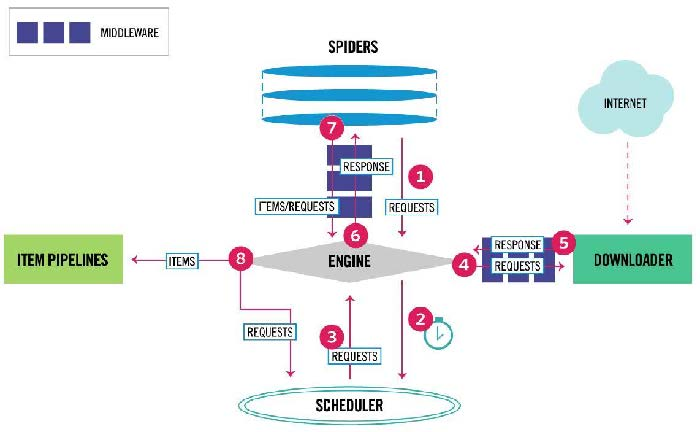

# Python-scrapy学习

##  Scrapy爬虫框架结构

Scrapy不是一个函数功能库，而是一个爬虫框架。

- 分布式，“5+2”结构

  

- 数据流的三个路径

  一、

  - Engine从Spider处获得爬取请求(Request)
  - Engine将爬取请求转发给Scheduler,用于调度

  二、

  - Engine从Scheduler处获得下一个要爬取的请求
  - Engine将爬取请求通过中间件发送给Downloader
  - 爬取网页后，Downloader形成响应(Response)通过中间件发给Engine
  - Engine将收到的响应通过中间件发送给Spider处理

  三、

  - Spider处理响应后产生爬取项(scraped Item)和新的爬取请求(Requests)给Engine
  - Engine将爬取项发送给Item Pipeline(框架出口)
  - Engine将爬取请求发送给Scheduler
  
  数据流的出入口
  
  - Engine控制各模块数据流，不间断从Scheduler处获得爬取请求，直至请求为空
  - 框架入口：Spider的初始爬取请求
  - 框架出口：Item Pipeline

- 用户编写(配置)：Spiders、Item Pipelines

- 已有实现：Engine、Downloader、Scheduler

## Scrapy爬虫框架解析

- Engine(不需要用户修改)
  - 控制所有模块之间的数据流
  - 根据条件触发事件

- Downloader(不需要用户修改)
  - 根据请求下载网页

- Scheduler(不需要用户修改)
  - 对所有爬取请求进行调度管理
- Sownloader Middleware(用户可以编写配置代码)
  - 目的：实施Engine、Scheduler和Downloader之间进行用户可配置的控制
  - 功能：修改、丢弃、新增请求或响应

- Spider(需要用户编写配置代码)
  - 解析Downloader返回的响应(Response)
  - 产生爬取项(scraped  item)
  - 产生额外的爬取请求(Request)

- Item Pipelines(需要用户编写配置代码)
  - 以流水线方式处理Spider产生的爬取项
  - 由一组操作顺序组成，类似流水线，每个操作是一个Item Pipeline类型
  - 可能操作包括：清理、检验和查重爬取项中的HTML数据、将数据存储到数据库

- Spider Middleware(用户可以编写配置代码)
  - 目的：对请求和爬取项的再处理
  - 功能：修改、丢弃、新增请求或爬取项

## Scrapy爬虫常用命令

*Scrapy使用命令行*

`>scrapy <command> [options] [args]`

| 命令             | 说明               | 格式                                        |
| ---------------- | ------------------ | ------------------------------------------- |
| **startproject** | 创建一个新工程     | `scrapy startproject <name> [dir]`          |
| **genspider**    | 创建一个爬虫       | `scrapy genspidr [options] <name> <domain>` |
| settings         | 获得爬虫配置信息   | `scrapy settings [options]`                 |
| **crawl**        | 运行一个爬虫       | `scrapy crawl <spidr>`                      |
| list             | 列出工程中所以爬虫 | `scrapy list`                               |
| shell            | 启动URL调试命令行  | `scrapy shell [url]`                        |

## Scrapy爬虫基本使用

  ### 实例

地址：`http://python123.io/ws/demo.html`

#### 步骤一

建立一个Scrapy爬虫工程，选取一个目录，然后执行命令：

`scrapy startproject python123demo`

- 生成的工程目录：
  - `python123demo/`	-->	外层目录
    - `scrapy.cfg`	-->	部署Scrapy爬虫的配置文件
      - `python123demo/`	-->	Scrapy框架的用户自定义Python代码
      - `_init_.py`	-->	初始化脚本
      - `items.py`	-->	Items代码模板（继承类）
      - `middlewares.py`	-->	Middlewares代码模板（继承类）
      - `pipelines.py`	-->	Pipelines代码模板（继承类）
      - `settings.py`	-->	Scrapy爬虫的配置文件
      - `spiders/`	-->	Spiders代码模板目录（继承类）
        - `_init_.py`	-->	初始文件，无需修改
        - `_pycache_/`	-->	缓存目录，无需修改
      - `_pycache_/`	-->	缓存目录，无需修改

#### 步骤二

在工程中产生一个Scrapy爬虫，进入工程目录，然后执行命令：

`scrapy genspider demo python123.io`

- 该命令作用：
  - 生成一个名称为demo的spider
  - 在spiders目录下增加代码文件demo.py(*该命令仅用于生成demo.py，该文件也可以手工生成*)

- ```python
  # -*- coding: utf-8 -*-
  import scrapy
  
  
  class DemoSpider(scrapy.Spider):
      name = 'demo'
      allowed_domains = ['python123.io']
      start_urls = ['http://python123.io/']
  
      def parse(self, response):#parse()用于处理响应，解析内容形成字典，发现新的URL爬取请求
          pass
  
  ```

#### 步骤三

配置产生的spider爬虫

配置：

- 初始URL地址

- 获取页面后的解析方式

  ```python
  # -*- coding: utf-8 -*-
  import scrapy
  
  
  class DemoSpider(scrapy.Spider):
      name = 'demo'
  #    allowed_domains = ['python123.io']#可选
      start_urls = ['http://python123.io/ws/demo.html']
  
      def parse(self, response):
          fname = response.url.split('/')[-1]
          with open(fname,'wb') as f:
              f.write(response.body)
          self.log('Saved file %s.'% fname)
          pass
  
  ```

  

#### 步骤四

运行爬虫，获取网页，在命令行下，执行命令：

`scrapy crawl demo`

demo爬虫被执行，捕获页面存储在demo.html

#### `demo.py`代码完整版本

```python
import scrapy

class DemoSpider(scrapy.Spider):
    name = 'demo'
#    allowed_domains = ['python123.io']#可选
    urls = [
        'http://python123.io/ws/demo.html'
    		]
    for url in urls:
        yield scrapy.Request(url=url,callback=self.parse)
        #yield关键词

    def parse(self, response):
        fname = response.url.split('/')[-1]
        with open(fname,'wb') as f:
            f.write(response.body)
        self.log('Saved file %s.'% fname)
```


## 生成器

- 包含yield语句的函数是一个生成器

- 生成器每次产生一个值（yield语句），函数被冻结，被唤醒后再产生一个值

- 生成器是一个不断产生值的函数

### 实例：求一组数的平方值

- 生成器：

  ```python
  >>> def gen(n):
  	for i in range(n):
  		yield i**2
  
  		
  >>> for i in gen(5):
  	print(i,' ',end="")
  
  	
  0  1  4  9  16 
  ```

- 普通：

  ```python
  >>> def square(n):
  	ls = [i**2 for i in range(n)]
  	return ls
  
  >>> for i in square(5):
  	print(i,' ',end='')
  
  	
  0  1  4  9  16 
  ```

- 生成器相比一次列出所有内容的优势：
  - 更节省存储空间
  - 响应更迅速
  - 使用更灵活

## Scrapy爬虫的数据类型

- Request类

  `class scrapy.http.Requests()`

  Request对象表示一个HTTP请求由Spider生成，由Downloader执行

  | 属性或方法 | 说明                                               |
  | ---------- | -------------------------------------------------- |
  | `.url`     | Request对应的请求URL地址                           |
  | `.method`  | 对应的请求方法，'GET' 'POST'等                     |
  | `.headers` | 字典类型风格的请求头                               |
  | `.body`    | 请求内容主体，字符串类型                           |
  | `.meta`    | 用户添加的扩展信息，在Scrapy内部模块间传递信息使用 |
  | `.copy()`  | 复制该请求                                         |

- Response类

  `class scrapy.http.Response()`

  Response对象表示一个HTTP响应由Downloader生成，由Spider处理

  | 属性或方法 | 说明                               |
  | ---------- | ---------------------------------- |
  | `.url`     | Response对应的URL地址              |
  | `.status`  | HTTP状态码，默认是200              |
  | `.header`  | Response对应的头部信息             |
  | `.body`    | Response对应的内容信息，字符串类型 |
  | `.flags`   | 一组标记                           |
  | `.request` | 产生Response类型对应的Request对象  |
  | `.copy()`  | 复制该响应                         |

- Item类

  `class scrapy.item.Item()`

  Item对象表示一个从HTML页面中提取的信息内容由Spider生成，由Item Pipeline处Item类似字典类型，可以按照字典类型操作

## Scrapy爬虫提取信息的方法

Scrapy爬虫支持多种HTML信息提取方法：

- Beautiful Soup
- lxml
- re
- XPath Selector
- **CSS Selector**
  - `<HTML>.css('a::attr(href)').extract()`*'a'为标签名称，'href'为标签属性*


