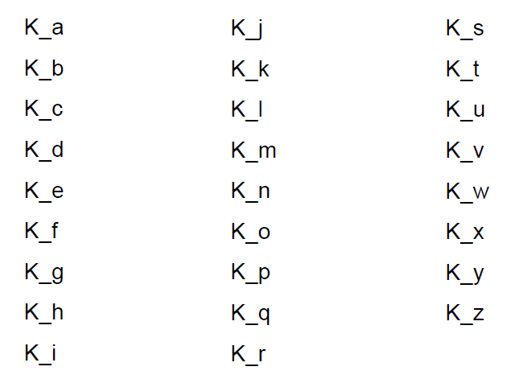

# Python-pygame学习笔记

## 屏幕控制

`pygame.display`

### 屏幕尺寸和模式

- `pygame.display.set_mode(r=(0,0), flag=0)`

  - r是游戏屏幕的分辨率，采用(width, height)方式输入

  - flags用来控制显示类型，可用|组合使用，常用显示标签如下：

    | 显示标签            | 功能                                                         |
    | ------------------- | ------------------------------------------------------------ |
    | `pygame.RESIZABLE`  | 窗口大小可调<br>*`pygame.VIDEORESIZE`:一种窗口大小更改的事件，发生后返回`event.size`元组，包含宽(`.size[0]`=`event.w`)、高(`.size[1]`=`event.h`)* |
    | `pygame.NOFRAME`    | 窗口没有边界显示<br>此时要考虑增加其他退出方式               |
    | `pygame.FULLSCREEN` | 窗口全屏显示<br>此时要考虑系统分辨率，否则将会按照用户设定被拉伸<br>*系统分辨率：`size = width, height = vInfo.current_w, vInfo.current_h`* |


- `pygame.display.Info()`
  - 产生一个显示信息对象VideoInfo，表达当前屏幕的参数信息
  - 在.set_mode()之前调用，则显示当前系统显示参数信息
  - 参数很多，其中有两个十分重要，如下：
    - `current_w`:当前显示模式或窗口的像素宽度
    - `current_h`:当前显示模式或窗口的像素高度

### 窗口标题和图标

- `pygame.display.set_caption(title, icontitle=None)`

  - `title`设置窗口的标题内容
  - `icontitle`设置图表化后的小标题（小标题可选，部分系统没有）

- `pygame.display.set_icon(surface)`

  - 设置窗口的图标效果

  - 图标是一个`Surface`对象

    ```python
    icon = pygame.image.load("flower.png")
    pygame.display.set_icon(icon)
    ```

- `pygame.display.get_caption()`

  - 返回当前设置窗口的标题及小标题内容
  - 返回结构为`(title, icontitle)`
  - 该函数与游戏交互逻辑配合，可以根据游戏情节修改标题内容

### 窗口感知和刷新

- `pygame.display.get_active()`
  - 当窗口在系统中显示(屏幕绘制/非图标化)时返回`True`，否则返回`False`
  - 该函数可以用来判断是否游戏窗口被最小化
  - 进一步，判断后可以暂停游戏，改变响应模式等
- `pygame.display.flip()`
  - 重新绘制整个窗口
- `pygame.display.update()`
  - 仅重新绘制窗口中有变化的区域，相比.flip()执行更快

## 事件

`pygame.event.EventType`

- 事件本质上是一种封装后的数据类型（对象）
- EventType是Pygame的一个类，表示事件类型
- 事件类型只有属性，没有方法
- 用户可自定义新的事件类型

### 事件类型

- 系统

  - `pygame.event.QUIT`
    - `none`
  - `pygame.event.ACTIVEEVENT`
    - `gain`
    - `state`

- 键盘

  | 事件\属性              | `event.unicode`                       | `event.key`    | `event.mod`                                   |
  | ---------------------- | ------------------------------------- | -------------- | --------------------------------------------- |
  | `pygame.event.KEYDOWN` | 按键的unicode码，平台有关，不推荐使用 | 按键的常量名称 | 按键修饰符的组合值<br>`event.mod = KMOD_ALT`  |
  | `pygame.event.KEYUP`   | /                                     | 按键的常量名称 | 按键修饰符的组合值<br/>`event.mod = KMOD_ALT` |

  - 按键的常量名称

    

    

    

    

- 鼠标

  | 事件\属性                                    | `event.pos`                           | `event.button`                                             | `event.rel`                           | `event.buttons`                         |
  | -------------------------------------------- | ------------------------------------- | ---------------------------------------------------------- | ------------------------------------- | --------------------------------------- |
  | `pygame.event.MOUSEMOTION`鼠标移动事件       | 鼠标当前坐标值(x,y)，相对于窗口左上角 | /                                                          | 鼠标相对运动距离(X,Y)，相对于上次事件 | 鼠标按钮状态(a,b,c)，对应于鼠标的三个键 |
  | `pygame.event.MOUSEBUTTONUP`鼠标键释放事件   | 同上                                  | 鼠标按下键编号n<br/>取值0/1/2，分别对应三个键              | /                                     | /                                       |
  | `pygame.event.MOUSEBUTTONDOWN`鼠标键按下事件 | 同上                                  | 鼠标按下键编号n<br/>取值为整数，左键为1，右键为3，设备相关 | /                                     | /                                       |

  

- 游戏杆
  - `pygame.event.JOYAXISMOTION`
    - `joy`
    - `axis`
    - `value`
  - `pygame.event.JOYBALLMOTION`
    - `joy`
    - `ball`
    - `rel`
  - `pygame.event.JOYHATMOTION`
    - `joy`
    - `hat`
    - `value`
  - `pygame.event.JOYBUTTONUP`
    - `joy`
    - `button`
  - `pygame.event.JOYBUTTONDOWN`
    - `joy`
    - `button`
- 窗口
  - `pygame.event.VIDEORESIZE`
    - `size`
    - `w`
    - `h`
  - `pygame.event.VIDEOEXPOSE`
    - `none`
- 用户定义
  - `pygame.event.USEREVENT`
    - `code`

### 事件处理重要函数

- 处理事件

  - `pygame.event.get()`

    - 从事件队列中获得事件列表，即获得所有被队列的事件

      ```python
      for event in pygame.event.get():
          if event.type == pygame.QUIT:
              sys.exit()
      ```

    - 可以增加参数，获得某类或某些类事件：

      - `pygame.event.get(type)`
      - `pygame.event.get(typelist)`

  - `pygame.event.poll()`

    - 从事件队列中获得一个事件

      ```python
      While True:
          event = pygame.event.poll()
      ```

    - 事件获取将从事件队列中删除

    - 如果事件队列为空，则返回event.NOEVENT

  - `pygame.event.clear()`

    - 从事件队列中删除事件，默认删除所有事件
    - 该函数与pygame.event.get()类似，区别仅是不对事件进行处理
    - 可以增加参数，删除某类或某些类事件：
      - `pygame.event.clear(type)`
      - `pygame.event.clear(typelist)`

- 操作事件队列

  - `pygame.event.set_blocked(type or typelist)`
    - 控制哪些类型事件不允许被保存到事件队列中
  - `pygame.event.get_blocked(type or typelist)`
    - 控制哪些类型事件允许被保存到事件队列中
  - `pygame.event.set_allowed(type)`
    - 测试某个事件类型是否被事件队列所禁止
    - 如果事件类型被禁止，则返回True，否则返回False

- 生成事件

  - `pygame.event.post(Event)`
    - 产生一个事件，并将其放入事件队列
    - 一般用于放置用户自定义事件（pygame.USEREVENT）
    - 也可以用于放置系统定义事件（如鼠标或键盘等），给定参数
  - `pygame.event.Event(type, dict)`
    - 创建一个给定类型的事件
    - 其中，事件的属性和值采用字典类型复制，属性名采用字符串形式
    - 如果创建已有事件，属性需要一致

  ```python
  # Unit PYG04: Pygame Event Post
  import pygame,sys
   
  pygame.init()
  screen = pygame.display.set_mode((600, 400))
  pygame.display.set_caption("Pygame事件处理")
  fps = 1
  fclock = pygame.time.Clock()
  num = 1
   
  while True:
      uevent = pygame.event.Event(pygame.KEYDOWN, {"unicode": 123, "key":pygame.K_SPACE, "mod":pygame.KMOD_ALT})
      pygame.event.post(uevent)
      num = num + 1
      for event in pygame.event.get():
          if event.type == pygame.QUIT:
              sys.exit()
          elif event.type == pygame.KEYDOWN:
              if event.unicode == "":
                  print("[KEYDOWN {}]:".format(num), "#", event.key, event.mod)
              else:
                  print("[KEYDOWN {}]:".format(num), event.unicode, event.key, event.mod)
                  
      pygame.display.update()
      fclock.tick(fps)
  ```

## 色彩

模式：

- `pygame.Color(name)`
- `pygame.Color(r, g, b, a)`
- `pygame.Color(rgbvalue)`

| `pygame.Color`类         | 功能                        |
| ------------------------ | --------------------------- |
| `pygame.Color.r`         | 获得Color类的红色值r        |
| `pygame.Color.g`         | 获得Color类的绿色值g        |
| `pygame.Color.b`         | 获得Color类的蓝色值b        |
| `pygame.Color.a`         | 获得Color类的不透明值a      |
| `pygame.Color.normalize` | 将RGBA各通道值归一到0-1之间 |

```python
# -*- coding: utf-8 -*-
#根据壁球移动状态修改游戏背景色

import pygame, sys

def RGBChannel(a):
    return 0 if a < 0 else (255 if a > 255 else int(a))

pygame.init()
size = width, height = 600, 400
speed = [1,1]
bgcolor = pygame.Color("black")
ball = pygame.image.load('image\\PYG02-ball.gif')
screen = pygame.display.set_mode(size, pygame.RESIZABLE)  #窗口大小可调
ballrect = ball.get_rect()
fps = 300
fclock = pygame.time.Clock()

while True:
    for event in pygame.event.get():
        if event.type == pygame.QUIT:
            sys.exit()
        elif event.type == pygame.KEYDOWN:
            if event.key == pygame.K_LEFT:
                speed[0] = speed[0] if speed[0] == 0 else (abs(speed[0]) - 1) * int(speed[0] / abs(speed[0]))
            elif event.key == pygame.K_RIGHT:
                speed[0] = speed[0] + 1 if speed[0] > 0 else speed[0] - 1
            elif event.key == pygame.K_UP:
                speed[1] = speed[1] + 1 if speed[1] > 0 else speed[1] - 1
            elif event.key == pygame.K_DOWN:
                speed[1] = speed[1] if speed[1] == 0 else (abs(speed[1]) - 1) * int(speed[1] / abs(speed[1]))

    ballrect = ballrect.move(speed[0],speed[1])
    if ballrect.left < 0 or ballrect.right > width:
        speed[0] = - speed[0]
    if ballrect.top < 0 or ballrect.bottom > height:
        speed[1] = - speed[1]

    bgcolor.r = RGBChannel(ballrect.left * 255 / width)
    bgcolor.g = RGBChannel(ballrect.top * 255 / height)
    bgcolor.b = RGBChannel(min(speed[0], speed[1]) * 255 / max(speed[0], speed[1], 1))

    screen.fill(bgcolor)
    screen.blit(ball, ballrect)
    pygame.display.update()
    fclock.tick(fps)
```

## 图形绘制

### `pygame.Rect`：任何一个图形绘制后，会返回一个矩形`Rect`类表示该形状

- 表达一个矩形区域的类，用于存储坐标和长度信息
- Pygame 利用 Rect 类来操作图形 /图像等元素
- 参数
  - `left`. `top`', '`width`, `height`
- 属性
  - `x`, `y`, `w`, `h`, `size`, `width`, `height`
  - `top`, `left`, `bottom`, `right`
  - `topleft`, `bottomleft`, `topright`, `bottomright`
  - `midtop`, `midleft`, `midbottom`, `midright`
  - `center`, `centerx`, `centery`
- 方法
  - `.copy()`, `.move()`, `.inflate()`, `.clamp()`, `.clip()`, `.union()`, `.unionall()`, `.fit()`, `.normalize()`, `.contains()`, `.collidepoint()`
  - `.colliderect()`, `.collidelist()`, `.collidelistall()`, `.collidedict()`, `.collidedictal1()`
- http://www.pygame.org/docs/ref/rect.html

### `pygame.draw`

- 矩形`pygame.draw.rect(Surface, color, Rect, width=0)`
  - `Surface`：矩形的绘制屏幕
  - `color`：矩形的绘制颜色
  - `Rect`：矩形的绘制区域
  - `width=0`：绘制边缘的宽度，默认为0，即填充图形

- 多边形`pygame.draw.polygon(Surface, color, pointlist, width=0)`

  - `Surface`：多边形的绘制屏幕
  - `color`：多变形的绘制颜色
  - `pointlist`：多边形顶点坐标列表
  - `width=0`：绘制边缘的宽度，默认为0，即填充图形

- 圆形`pygame.draw.circle(Surface, color, pos, radius, width=0)`

  - `Surface`：圆形的绘制屏幕
  - `color`：圆形的绘制颜色
  - `pos`：圆形的圆心坐标
  - `radius`：圆形的半径
  - `width=0`：绘制边缘的宽度，默认为0，即填充图形

- 椭圆形`pygame.draw.ellipse(Surface, color, Rect, width=0)`

  - `Surface`：椭圆形的绘制屏幕
  - `color`：椭圆形的绘制颜色
  - `Rect`：椭圆形的绘制区域

  - `width=0`：绘制边缘的宽度，默认为0，即填充图形

- 椭圆弧形`pygame.draw.arc(Surface, color, Rect, start_angle, stop_angle, width=0)`

  - `Surface`：椭圆弧形的绘制屏幕
  - `color`：椭圆弧形的绘制颜色
  - `Rect`：椭圆弧形的绘制区域
  - `start_angle`, `stop_angle`：弧形绘制起始和结束弧度值（横向右侧为0度）

  - `width=0`：绘制边缘的宽度，默认为0，即填充图形

- 直线`pygame.draw.line(Surface, color, start_pos, end_pos, width=1)`

  - `Surface`：直线的绘制屏幕
  - `color`：直线的绘制颜色
  - `start_pos`, `end_pos：`：直线的起始和结束坐标
  - `width=1`：直线的宽度，默认值为1

- 连续多线`pygame.draw.lines(Surface, color, closed, pointlist, width=1)`

  - `Surface`：直线的绘制屏幕
  - `color`：直线的绘制颜色
  - `closed`：如果为`True`，起止节点间自动增加封闭直线
  - `pointlist`：连续多线顶点坐标列表
  - `width=1`：连续多线的宽度，默认值为1

- 无锯齿线`pygame.draw.aaline(Surface, color, start_pos, end_pos, blend=1)`

  - `Surface`：无锯齿线的绘制屏幕
  - `color`：无锯齿线的绘制颜色
  - `start_pos`, `end_pos：`：无锯齿线的起始和结束坐标
  - `blend=1`：不为0时，与线条所在背景颜色进行混合

- 连续无锯齿线`pygame.draw.aalines(Surface, color,closed, pointlist, blend=1)`

  - `Surface`：连续无锯齿线的绘制屏幕
  - `color`：连续无锯齿线的绘制颜色
  - `closed`：如果为`True`，起止节点间自动增加封闭直线
  - `pointlist`：连续无锯齿线顶点坐标列表
  - `blend=1`：不为0时，与线条所在背景颜色进行混合

### `pygame.freetype`：文字绘制

- 向屏幕上绘制特定字体的文字
- 文字不能直接`print()`，而是用像素根据字体点阵图绘制
- `pygame.freetype`是绘制文字的增强方法，建用使用
  - `import pygame.freetype`
- `pygame.freetype.Font(file, size=0)`：根据字体字号生成`Font`对象
  - `Font.render_to()`, `Font.render()`：用`Font`对象的`render*`方法绘制具体文字
- `Font.render_to(surf, dest, text, fgcolor=None, bgcolor=None, rotation=0, size=0)` => `Rect`
  - `surf`：绘制字体的平面，`Surface`对象
  - `dest`：在平面中的具体位置，`(x,y)`
  - `text`：绘制的文字内容
  - `fgcolor`：文字颜色
  - `bgcolor`背景颜色
  - `rotation`：逆时针的旋转角度，取值0-359，部分字体可旋转
  - `size`：文字大小，覆盖`Font`中的设定值
- `Font.render(text, fgcolor=None, bgcolor=None, rotation=0, size=0)` => `(Surface, Rect)`
  - `text`：绘制的文字内容
  - `fgcolor`, `bgcolor`：字体颜色，背景颜色
  - `rotation`：逆时针的旋转角度，取值0-359，部分字体可旋转
  - `size`：文字大小

## 绘图机制原理

### 主图层

- 由`pygame.display.set_mod()`生成的`Surface`对象

  ```python
  size = width, height = 600,400
  screen = pygame.display.set_mode(size)
  ```

- 在主图层上绘制其他图层使用`.blit()`方法

  ```python
  screen.blit(ball, ballrect)
  #ball => pygame.Surface
  #ballrect => pygame.Rect
  ```

### `pygame,Surface`：绘图层，或绘图平面，或图像

- 用于表示图形、文字或图像的绘制效果
- 与当前屏幕主图层可以并列存在
- 如果不绘制在主图层上，则不会被显示

### `pygame.Rect`：矩形区域

- 对应于当前主图层的某个具体区域
- 相当于某个矩形区域的指针或标识信息
- 可以指定图层绘制在某个矩形区域当中